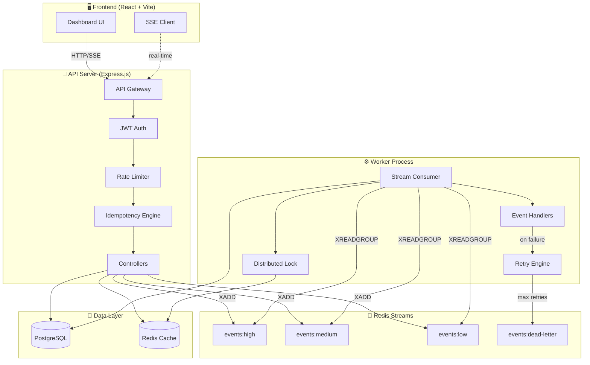
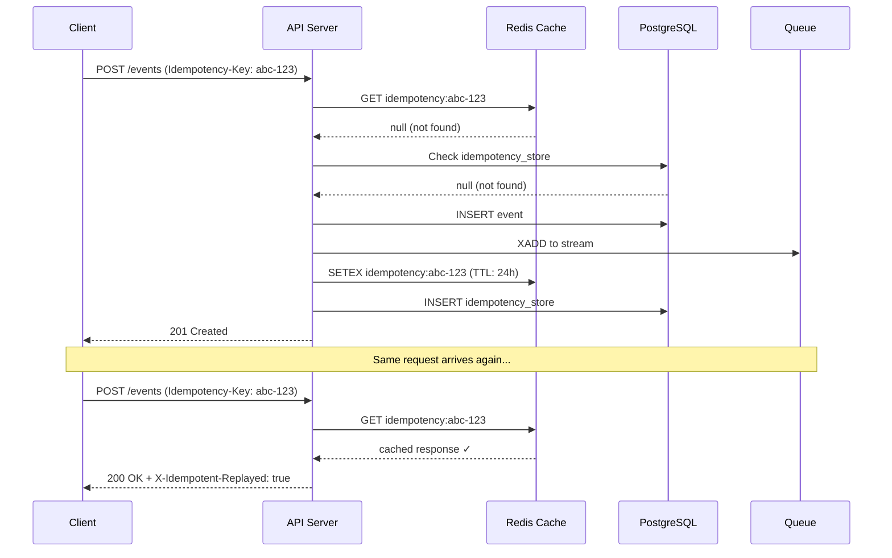

<div align="center">

# ⚡ Idempotent Event Processing System

### Production-grade event processing with guaranteed exactly-once delivery

[](https://nodejs.org/)
[](https://expressjs.com/)
[](https://www.postgresql.org/)
[](https://redis.io/)
[](https://reactjs.org/)
[](https://www.docker.com/)
[](https://www.prisma.io/)
[](https://tailwindcss.com/)

---

*A sophisticated distributed event processing system that ensures every event is processed exactly once, even when the same event is received multiple times. Built with Redis Streams for queuing, distributed locks for concurrency safety, and a stunning real-time dashboard.*

</div>

---

## 🏗️ Architecture



## ✨ Features

### Core Engine
- ✅ **Idempotency Guarantee** — Every event requires an `Idempotency-Key` header. Duplicates are detected via Redis (fast) + PostgreSQL (permanent audit)
- ✅ **Redis Streams Queue** — Priority-based queuing (HIGH/MEDIUM/LOW) with consumer groups
- ✅ **Distributed Locking** — `SET NX PX` with Lua-script safe release prevents concurrent processing
- ✅ **Exponential Backoff Retry** — Failed events retry with `2^n` second backoff (max 5 retries)
- ✅ **Dead Letter Queue** — Events exceeding max retries are quarantined with full error history
- ✅ **CRITICAL Priority Bypass** — Critical events skip the queue and process synchronously

### API & Security
- ✅ **JWT Authentication** — Secure login/register with bcrypt password hashing
- ✅ **API Key Management** — Generate, list, and revoke API keys with SHA-256 hashing
- ✅ **Sliding Window Rate Limiting** — Redis sorted set-based rate limiter with `Retry-After` headers
- ✅ **Request ID Tracing** — UUID per request attached to all logs and response headers
- ✅ **Swagger/OpenAPI Docs** — Auto-generated interactive API documentation

### Real-Time Dashboard
- ✅ **Live Event Feed** — Server-Sent Events (SSE) for real-time updates
- ✅ **Webhook Simulator** — Prove idempotency by sending N duplicate events
- ✅ **Metrics & Charts** — Throughput, processing times, error rates, queue depth
- ✅ **Event Inspector** — JSON payload viewer, retry timeline, cURL generator
- ✅ **DLQ Management** — Replay, bulk replay, or discard dead events

### Operations
- ✅ **Docker Compose** — One command to run the entire stack
- ✅ **Graceful Shutdown** — Drain queues on SIGTERM
- ✅ **Structured Logging** — Winston with JSON format and request tracing
- ✅ **Health Checks** — PostgreSQL + Redis connectivity monitoring
- ✅ **Environment Validation** — envalid ensures all required config is present

## 🚀 Quick Start

### Prerequisites
- Docker & Docker Compose
- Node.js 18+ (for local development)

### Run with Docker (3 commands)

```bash
# 1. Clone & enter the project
git clone <your-repo-url> && cd idempotent-event-processor

# 2. Start all services
docker compose up -d

# 3. Open the dashboard
open http://localhost:5173
```

### Run Locally (Development)

```bash
# Start infrastructure
docker compose up -d postgres redis redis-commander

# Backend
cd backend
npm install
npx prisma migrate dev
npm run dev

# Worker (separate terminal)
cd backend
npm run worker:dev

# Frontend (separate terminal)
cd frontend
npm install
npm run dev
```

## 📡 API Endpoints

| Method | Endpoint | Description |
|--------|----------|-------------|
| `POST` | `/api/v1/auth/register` | Register a new user |
| `POST` | `/api/v1/auth/login` | Login with email/password |
| `GET` | `/api/v1/auth/profile` | Get current user profile |
| `POST` | `/api/v1/events` | Ingest a new event (requires `Idempotency-Key` header) |
| `GET` | `/api/v1/events` | List events with filters & pagination |
| `GET` | `/api/v1/events/:id` | Get event details with retry history |
| `POST` | `/api/v1/events/:id/replay` | Replay an event with new idempotency key |
| `GET` | `/api/v1/events/stream` | Real-time SSE event stream |
| `GET` | `/api/v1/events/export` | Export events as CSV |
| `GET` | `/api/v1/dlq` | List dead letter events |
| `POST` | `/api/v1/dlq/:id/replay` | Replay a dead event |
| `POST` | `/api/v1/dlq/bulk-replay` | Bulk replay dead events |
| `DELETE` | `/api/v1/dlq/:id` | Discard a dead event |
| `POST` | `/api/v1/simulate/webhook` | Simulate duplicate webhooks |
| `GET` | `/api/v1/metrics` | System metrics & health |
| `GET` | `/api/v1/api-keys` | List API keys |
| `POST` | `/api/v1/api-keys` | Create new API key |
| `GET` | `/health` | Health check |
| `GET` | `/api-docs` | Swagger UI |

## 🔄 How Idempotency Works



## 🗄️ Database Schema

```
┌──────────────┐     ┌──────────────────┐     ┌───────────────┐
│    users      │     │     events       │     │  retry_logs   │
├──────────────┤     ├──────────────────┤     ├───────────────┤
│ id (UUID)     │     │ id (UUID)        │────→│ id (UUID)     │
│ email         │     │ idempotencyKey   │     │ eventId (FK)  │
│ passwordHash  │     │ type             │     │ attemptNumber │
│ name          │     │ payload (JSONB)  │     │ attemptedAt   │
│ createdAt     │     │ metadata (JSONB) │     │ error         │
└──────┬───────┘     │ status           │     │ nextRetryAt   │
       │             │ priority         │     └───────────────┘
       │             │ retryCount       │
┌──────┴───────┐     │ processingTimeMs │     ┌───────────────┐
│   api_keys   │     │ errorMessage     │     │    alerts     │
├──────────────┤     │ createdAt        │     ├───────────────┤
│ id (UUID)    │     └────────┬─────────┘     │ id (UUID)     │
│ userId (FK)  │              │               │ eventId (FK)  │
│ name         │     ┌────────┴─────────┐     │ type          │
│ keyHash      │     │idempotency_store │     │ message       │
│ rateLimit    │     ├──────────────────┤     │ severity      │
│ expiresAt    │     │ key (PK)         │     │ createdAt     │
│ isActive     │     │ eventId (FK)     │     └───────────────┘
└──────────────┘     │ responsePayload  │
                     │ expiresAt        │
                     └──────────────────┘
```

## 📁 Project Structure

```
├── backend/
│   ├── src/
│   │   ├── controllers/     # Request handlers
│   │   ├── handlers/        # Event type processors
│   │   ├── middleware/       # Auth, rate limit, idempotency
│   │   ├── routes/          # Express routes with Swagger docs
│   │   ├── services/        # Business logic (queue, lock, metrics)
│   │   ├── utils/           # Logger, Redis, Prisma, config
│   │   ├── app.js           # Express configuration
│   │   ├── server.js        # API server entry
│   │   └── worker.js        # Worker process entry
│   ├── prisma/
│   │   └── schema.prisma    # Database schema
│   └── Dockerfile
├── frontend/
│   ├── src/
│   │   ├── components/      # Layout, charts, UI
│   │   ├── hooks/           # useEvents, useMetrics, useSSE
│   │   ├── lib/             # API client, auth context, utils
│   │   └── pages/           # All 9 dashboard pages
│   └── Dockerfile
├── docker-compose.yml       # 6 services orchestration
├── .env                     # Environment configuration
└── README.md
```

## 🛠️ Tech Stack

| Layer | Technology | Purpose |
|-------|-----------|---------|
| **Runtime** | Node.js 20 | Server-side JavaScript |
| **API** | Express.js 4 | HTTP framework |
| **Database** | PostgreSQL 16 | Persistent event storage |
| **Cache/Queue** | Redis 7 | Caching, streams, locks, rate limiting |
| **ORM** | Prisma | Type-safe database access |
| **Queue** | Redis Streams | Priority-based event queuing |
| **Auth** | JWT + bcrypt | Token-based authentication |
| **Validation** | Zod | Runtime schema validation |
| **Logging** | Winston | Structured logging |
| **Docs** | Swagger/OpenAPI | Auto-generated API documentation |
| **Frontend** | React 18 + Vite | Dashboard UI |
| **Styling** | Tailwind CSS 3 | Utility-first CSS |
| **Charts** | Recharts | Data visualization |
| **Animation** | Framer Motion | Smooth UI transitions |
| **Container** | Docker Compose | Multi-service orchestration |

## 📊 Services

| Service | Port | Description |
|---------|------|-------------|
| API Server | 3000 | Express.js backend |
| Worker | — | Background event processor |
| Frontend | 5173 | React dashboard |
| PostgreSQL | 5432 | Primary database |
| Redis | 6379 | Cache, queue, locks |
| Redis Commander | 8081 | Redis debug GUI |

## 📄 License

MIT

---

<div align="center">
  <sub>Built with ❤️ as a portfolio project demonstrating distributed systems, event-driven architecture, and idempotent processing patterns.</sub>
</div>
